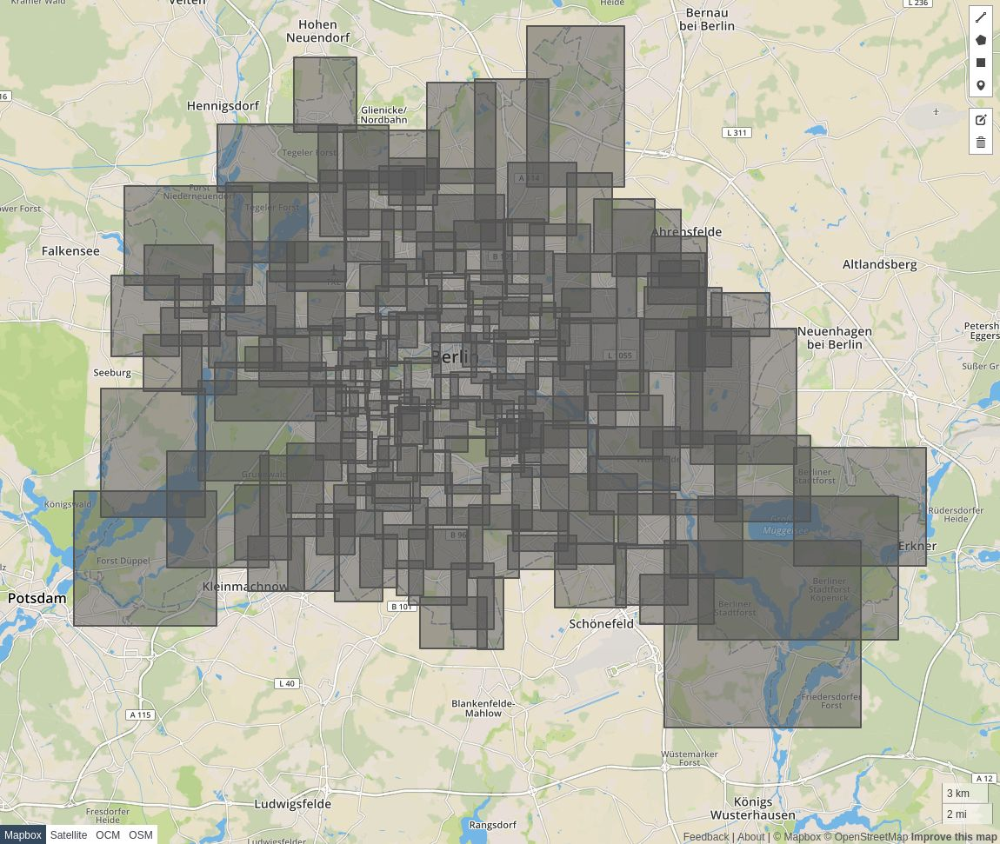

<h1 align='center'>postcodes</h1>

  

## Table of Contents

1. [Overview](#overview)
2. [Usage](#usage)
    - [extract](#extract)
    - [prepare](#prepare)
    - [pyramid](#pyramid)
3. [Datasets](#license)
4. [Development](#license)
5. [License](#license)

## Overview

[**Demo**](https://robofarmio.github.io/postcodes/)

This project provides tools and algorithms to extract, prepare, and pre-compute German post code areas for prefix-based iterative lookups.
As an example, say the user enters the German post code "10247" for Berlin, Friedrichshain.

When the user enters
- "1" we already want to pan and zoom the map to the Berlin / Brandenburg zone
- "10" we already want to pan and zoom the map to the Berlin region
- "102" we already want to pan and zoom the map to the Friedrichshain area

These iterative prefix-based lookups require pre-computation to efficiently pan and zoom the map in an instant.

Note: our initial use case is German post codes, but it's possible to extend it to other prefix-based post code schemes.
- https://en.wikipedia.org/wiki/Postal_codes_in_Germany
- https://wiki.openstreetmap.org/wiki/Free_The_Postcode#DE

## Usage

The following shows command line tools to process and work with the post code data.

### extract

To extract post codes from OpenStreetMap

    postcodes extract postcodes.geojson berlin-latest.osm.pbf

This will generate a `postcodes.geojson` file with
- one `MultiPolygon` feature per post code area
- a `postcode` property on each feature with the area's post code

### prepare

To prepare post code areas for lookup

    postcodes prepare bounds.geojson postcodes.geojson

This will generate a `bounds.geojson` file with
- one `Polygon` feature representing the area's bounds per post code feature
- a `postcode` property on each feature with the area's post code

### pyramid

To build a post code prefix search tree pyramid

    postcodes pyramid pyramid.geojson bounds.geojson

This will generate a `pyramid.geojson` file with
- one `Polygon` feature representing the area's bounds per post code prefix feature
- a `postcode` property on each feature with the area's post code prefix

We generate five prefix tree levels (German post codes are made up of five characters)
- the first level contains bounds for all post code areas starting with a single character
- the second level contains bounds for all post code areas starting with two character

and so on.

## Datasets

We recommend using OpenStreetMap snapshots provided by the lovely Geofabrik folks

    wget http://download.geofabrik.de/europe/germany/berlin-latest.osm.pbf

For more see http://download.geofabrik.de

Note: OpenStreetMap data is licensed under the Open Database License (ODbL).

## Development

Create a self-contained docker environment and enter it

    make
    make run

or use the image directly

    docker run robofarm/postcodes --help

## License

Copyright © 2020 robofarm

Distributed under the MIT License (MIT).
